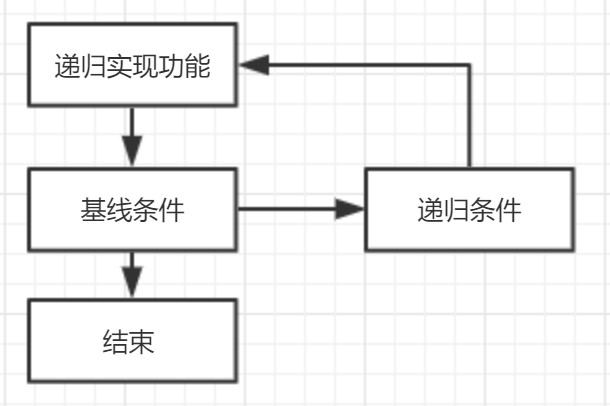

《算法图解》的读书笔记。
<!--more-->
### 大O表示法
大O表示法是指算法运行有多快，指出了算法运行时间的增速。用大O表示法表示算法运行时间。

常见的大O时间：
0.O(1)：常量时间
1.O(log n)：对数时间，二分查找
2.O(n)：线性时间，简单查找
3.O(n * log n)：快速排序（平均，最差情况为O(n^2)），合并排序（总是）（常用快速，而非合并，因为快速查找使用时间较短）
4.O(n^2)：选择排序
5.O(n!)：旅行商问题

### 数据结构
数组：读取速度快
链表：插入、删除速度快
栈：后入先出。所有函数调用都进入调用栈（调用栈过长会占用大量内存）
队列：先进先出
散列表：key-value

### 二分查找
仅当列表有序时，才管用。

### 选择排序
遍历列表，选择最大的值，添加进新的列表中。对余下的数组循环这个过程，直到全部排完。

### 递归
需要有基线条件和递归条件

#### 分而治之（D&C: divide and conquer）

1.找出基线条件
2.不断将问题分解（缩小规模），直到符合基线条件

#### 归纳证明
分为基线条件和归纳条件。
例：在基线条件中，证明算法对空数组或包含一个元素的数组有效；在归纳条件中，算法对一个元素的数组有效、对含两个元素的数组也有效（对含k个元素的数组管用，并对k+1个元素的数组也管用），那么可以推断出对任何元素的数组都管用。

### 快速排序
快速排序就使用D&C策略。
步骤：
1.随机选择基准值；
2.将数组分成两个子数组：小于基准值的和大于基准值的。
3.对这两个子数组进行快速排序。

### 散列表
散列函数要求：
1.散列函数必须是一致的。
2.不同输入映射不同输出结果。

散列函数特点：
1.散列函数总是将同样的输入映射到相同索引。
2.散列函数总是将不同的输入映射到不同的索引。
3.散列函数记录数组的大小，只返回有效索引。

用途：
1.用于快速查找，O(1)。
2.防止重复。
3.用于缓存。

优化冲突（两个不同键对于同个位置（需要使用链表存储，极端情况影响性能））：
1.较低的装填因子；
	装填因子=散列表包含的元素数/位置总数
	装填因子越低，发生冲突的可能性越小，散列表性能越高。
	常见规则：装填因子大于0.7，需要调整散列表长度。
2.良好的散列函数。
	避免“扎堆”
	例：SHA函数

### 广度优先搜索（图算法，breadth-first search,BFS）——非加权图
可以解决如下问题：
1.从节点A出发，是否有到节点B的路径
2.从节点A出发，是否有到节点B的最短路径

使用图建立模型，使用队列实现
检查过的人不需要再次检查，否则可能导致无限循环。

### 狄克斯特拉算法——加权图
找最快的路径，仅可用于有向无环加权图，不可用于包含父权边的图。
算法步骤：
1.找出“最便宜”的节点，即可在最短时间内达到的节点
2.更新该节点的邻居节点的开销
3.重复该过程，直到全部节点都执行完。

有向图中，包含父权边——使用贝尔曼-福德算法

### 贪婪算法
“每步都选择局部最优解”
易于实现、运行速度较快，是不错的近似算法。

#### 背包问题
使用贪婪策略，可以获得近似解，但获取不到最优解：
1.装入可装入的最贵的商品
2.再装入可以装入的最贵的商品，依次类推。

### NP完全问题
旅行商问题、集合覆盖问题
特点：需要计算所有的解，并从中选择最小/最短的那个。
没有快速解决方案，最佳做法是使用近似算法
O(n!)

哪些是NP完全问题：
1.元素较少时，算法运行速度非常快，但随这元素数量增加，速度会变得非常慢。
2.涉及“所有组合”的问题。
3.不能将问题分成小问题，必须考虑各种可能的情况的问题。
4.问题涉及序列（旅行商问题的城市序列）且难以解决。
5.问题涉及集合（广播台集合）且难以解决。
6.问题可以转换为集合覆盖问题或旅行商问题。

### 动态规划
算法公式：答案在最后单元格
$$
cell[i][j]  = 两者中较大的那个：`
  \begin{cases} 
   1.上一个单元格的值（即cell[i-1][j]的值）\\
   2.当前商品的价格 + 剩余空间的价值（指cell[i-1][j-当前商品的重量]）
  \end{cases}
$$

可解决问题：
1.背包问题
2.旅游行程最优化

注意：仅当每个子问题都是离散的（不依赖于其他子问题），动态规划才管用。
1.可以在给定约束条件下找到最优解
2.问题可以分解为彼此独立且离散的子问题时，才可以使用动态规划
3.动态规划的解决方案都涉及网格
4.单元格的值就是要优化的值
5.每个单元格都是一个子问题，设计方案时要考虑如何分解问题

#### 最长公共子串
1.如果两个字母不相同，值为0
2.如果两个字母相同，值为左上角邻居加1

注意：问题最终答案并不在最后一个单元格中，而是网格中的最大数字 

#### 最长公共子序列
1.如果两个字母不同，就选择上方和左方邻居中较大的那个
2.如果两个字母相同，则当前单元格的值为左上方单元格的值加1

答案在最后单元格

### K最近邻算法 
1.特征抽取
2.计算相似度：毕达哥拉斯公式（如下）、余弦相似度（常用）
$$
    \sqrt (x_1-x_2)^2  + \sqrt  (y_1-y_2)^2  
$$

用途：
	分类——编组
	回归——预测结果