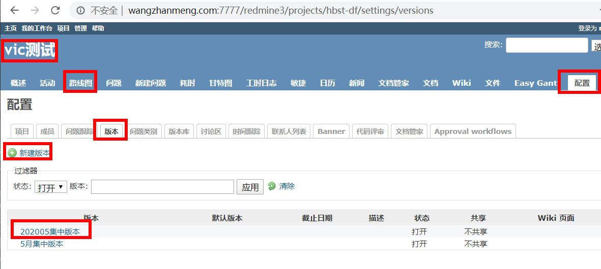
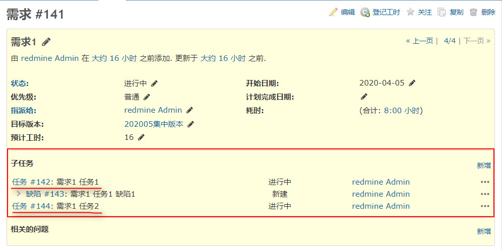
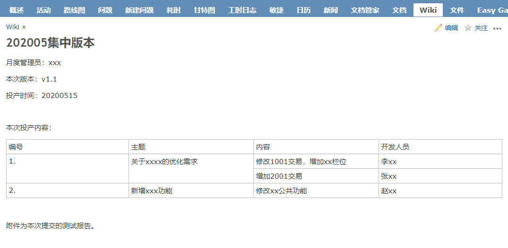

使用redmine用来管理项目进度的过程记录。

（有空建议打一个tfs，看起来更舒服）

<!--more-->

起源：公司项目管理方式不统一，日常工作都是使用excel表格追溯，不利于回顾。项目管理软件又迟迟审批不下来，所以各项目目前自发使用redmine来进行项目管理。

角色：**<u>需求</u>**、测试、开发、**<u>月度版本管理</u>**、<u>**代码版本管理**</u>

项目使用路线图进行版本管理：

项目-配置-版本-新建版本

1.系统分析师接到需求后，**<u>新建需求</u>**，并**<u>将需求拆分新建多个任务</u>**（状态为新建），并指派给对应开发（可以为多个）。

（1）登记基本信息，上传需求文档

（2）评估工时（以最小时间2h计，倍数递增），登记版本

（3）拆分任务：按功能点/交易模块，拆分任务，并指派，同时需要评估模块开发时间（以最小时间2h计，倍数递增）

2.开发人员接到**<u>任务</u>**后，开始开发工作（状态为进行中），更新进度，**<u>开发完成后将任务指派给测试人员</u>**

3.测试人员开始测试工作，该功能点有缺陷时，**<u>新建缺陷</u>**并指派给开发人员处理（状态为新建）

4.开发人员修复缺陷后，指回给对应测试人员，状态置为**<u>已解决</u>**

5.测试人员验证缺陷修复情况，并**<u>关闭缺陷</u>**

6.测试人员任务验证通过后，将<u>**任务关闭**</u>

7.全部任务关闭后，需求人员<u>**关闭需求**</u>，并通知开发人员**<u>准备代码清单</u>**。（目前在svn，后期考虑redmine，或者转为git后使用tag）

8.版本人员投产前（时间建议提早、预留准生产复测时间），统计版本清单，登记wiki。

9.代码版本管理员接到清单后，合并代码，部署准生产给测试人员复测。

10.测试通过，代码版本管理员合并投产代码，通知测试中心打包，并在投产演练环境验证投产包及脚本。

11.测试中心验证通过，根据**<u>版本wiki</u>**，将放至待投产仓库内。