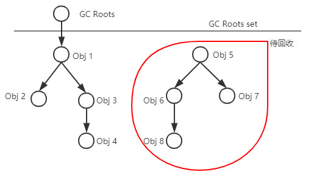

面试前知识点总结。

<!-- more -->
## 一、前后端分离
当下有很多的基于语言的模板引擎：freemarker、beetl、thymeleaf 等，基于模板引擎的开发还是前后端存在耦合的。
核心思想是**前端HTML页面通过AJAX调用后端的RESTFUL API接口并使用JSON数据进行交互**。
1.未分离
前端请求--->后端servlet处理--->展示层jsp
后端还会采用模板引擎（FreeMarker、thymeleaf等）
这种方式需要前端先开发html页面，后端开发完接口后，再将html改为jsp文件集成接口。
耦合性太强，前端需要掌握各种模板引擎写法；jsp初次加载时需要翻译为servlet耗时较久的弊端。

2.半分离
前端开发页面--->后端通过接口（Ajax）获取数据--->前端采用Dom操作对页面进行数据绑定，最终是把页面渲染出来。
由于前端因为没有掌握controller层，前端需要跟后端讨论页面是要同步输出还是异步Json渲染，所以为半分离
  弊端：
      1）JS存在大量冗余，在业务复杂的情况下，页面的渲染部分的代码，非常复杂；
      2）在Json返回的数据量比较大的情况下，渲染的十分缓慢，会出现页面卡顿的情况；
      3）SEO（ Search Engine Optimization，即搜索引擎优化）非常不方便，由于搜索引擎的爬虫无法爬下JS异步渲染的数据，导致这样的页面，SEO会存在一定的问题；
      4）资源消耗严重，在业务复杂的情况下，一个页面可能要发起多次HTTP请求才能将页面渲染完毕。（特别是移动端）

3.全分离
前端负责view和controller层
后端只负责model层，业务处理与数据持久化等
前端Controller：node.js——适合运用在高并发、I/O密集、少量业务逻辑的场景
	浏览器请求--->node.js--->后端服务
 浏览器(webview)不再直接请求JSP的API，而是：
      1）浏览器请求服务器端的NodeJS；
      2）NodeJS再发起HTTP去请求JSP；
      3）JSP依然原样API输出JSON给NodeJS；
      4）NodeJS收到JSON后再渲染出HTML页面；
      5）NodeJS直接将HTML页面flush到浏览器；
      这样，浏览器得到的就是普通的HTML页面，而不用再发Ajax去请求服务器了。

## 持久层框架：Jpa和Mybatis
Jpa (Java Persistence API) 是 Sun 官方提出的 Java 持久化规范。
Spring Data Jpa 是 Spring 基于 ORM 框架、Jpa 规范的基础上封装的一套 Jpa 应用框架。
mybatis是一个半自动化的持久层框架。
传统公司：hibernate ---> Jpa ---> Spring Data Jpa
互联网公司：ibatis ---> mybatis
ref：https://blog.csdn.net/fuzhongmin05/article/details/81591072 

## @Controller和@RestController
**@RestController相当于@ResponseBody ＋ @Controller**
1.仅使用@RestController注解Controller，则Controller中的方法无法返回页面（InternalResourceViewResolver不起作用）
2.@Controller配合视图解析器InternalResourceViewResolver可以返回至return中的页面。
如果需要返回JSON，XML或自定义mediaType内容到页面，则需要在对应的方法上加上@ResponseBody注解。

## JVM的垃圾回收
1.回收算法：
（1）引用计数算法
	对象添加计数器，引用就加1，计数器为0时不再被使用到
	优：实现简单、判断效率高
	缺：无法解决循环引用问题
（2）可达性分析算法（java虚拟机使用）
	通过GC Roots的对象作为起始点，从这些节点向下搜索，搜索走过的路径称为引用链，当有对象到GC Roots没有引用链时，说明对象不可达。
	
	优：精确严谨，可以分析出循环引用的情况
	缺：实现复杂，消耗大量时间，分析过程中需要保证引用关系不能发生变化，需要GC停顿，将挺短所有Java执行线程（“Stop The World”）
2.引用
（1）类型：
	强引用：Object object = new Object(); 强引用还存在，被引用的对象
	软引用：有用但非必须的对象。内存不够时（抛OOM Error之前），才会被垃圾回收。
	弱引用：非必须对象。垃圾回收器工作即会回收。
	虚引用：对象有虚引用不会影响其生存时间。
（2）筛选过程：

