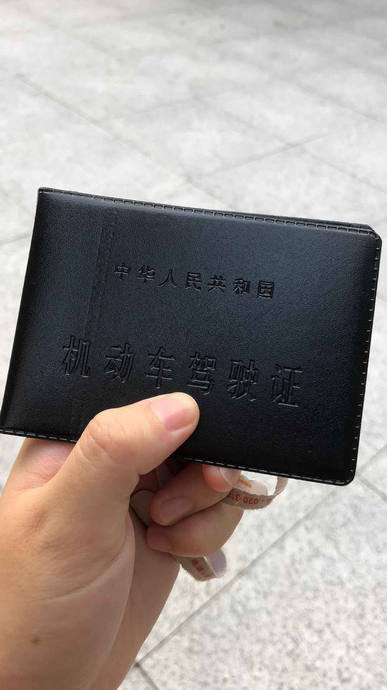

驾考的艰辛历程（说多了都是lui啊 😭）

<!--more-->

## 一、报考

纠结了n久，还是选择了传统驾校报名，互联网学车总是觉得有点不靠谱。小V目前还是学生，所以优惠价五千不到，还包括了补考学费，这在广州来说，已经是超超超超级便宜的了。
​	
驾校报名之后，就是拍证件照(柯达就好，相馆老板还是帮你修图，关乎之后几年的驾照照片，所以还是要修的美美的比较好)。准备好这些资料后，就是等驾校的客服小姐姐帮忙录入车管所系统了，等待时间大概三五天左右。

## 二、集中培训

车管所审核资料通过后，会发短信来通知审核结果，另外，小v所在的驾校还会组织一次集中线下培训。线下培训是在驾驶理论培训基地统一上课，一个教室大概150人左右，培训一天。培训老师会把整个驾考流程、理论考试易错点以及实操考试注意事项等详细讲解。注意认真听，基本上都是重点，相当于把即将遇到的坑都给你讲清楚了。

## 三、科目一

#### 1. 刷题备考

下面是科目一的备考。注意有些驾校要求学生做至少三套试卷（手机APP的选择等下讲)，且分数必须在93分以上才给报名的，所以科目一的题可以在通知上理论课的时候就可以刷了。
​	
先说APP的选择，个人觉得驾校宝典和驾校一点通都可以，功能都是一样的，但是驾校推荐使用驾校宝典，所以小v最终还是选择了它。
​	
APP刷题时，切忌直接开始模拟，要先全部刷一遍所有题型，错题多看两遍，灵活使用APP的“收藏”功能。刷过全部题型之后，再把自己的错题多刷几遍(两遍至少)，之后才能开始做模拟套题。模拟套题要确保每次都有95分以上，那就可以大胆去考了。

#### 2.考试

小v考试地方在化龙，驾校提前通知在某个地方等，教练开车把大家集体接过去考场。路程大概将近一个小时，一点开考，所以稍微晚一点，前面的人正好考完，不用排很久的队，去到就可以考。进考场时刷身份证，有空位置就可以坐下来考试，注意考试时候不能用手机，会视为作弊行为处理。
​	
考试时是没人一台装有摄像头的电脑，大家用自己的身份证号登入，对准摄像头拍照记录。多人同时在线操作可能会导致系统提交比较卡顿，所以在做题时，需要用比平时刷题要多的时间和耐心。基本上一题选择好答案后，点击提交，需要等待至少3~5秒，这时候不要频繁点击，要耐心一点等待。曾有一起去考试的同学，因为系统卡顿，但是频繁点击提交，导致失误操作，险些不通过，所以这一点还是要注意一下。
​	
答案卡上显示红色的是自己的错题，注意把握做题节奏。全部做完之后，会有弹窗显示本次考试是否通过。如果没有通过，则举手示意监考人员，在座位上等待5-10分钟，以后刷新重新做另一套套题。机试考试有两次机会，两次均不通过，则此次考试失败，通知客服人员重新安排补考。

## 四、科目二

### 1.上车

检查车身，上车，关门，系安全带，松手刹。

### 2.倒车入库

#### 左侧：

（1）挂一档，轻放离合，前行至黄线刚过肩膀，快速向左打一圈加90°；

（2）维持方向盘不动，开至前车轮过黄线，踩刹车停车；

（3）挂倒挡，松刹车，看左后视镜，倒车；

（4）倒车至左后车轮在入库延长线30cm处，方向盘回90°；

（5）看右后视镜，车身与入库线角度小于10°，回正方向盘。

（6）继续缓慢倒车，看左后视镜，直到左后视镜把手挡住入库线，踩刹车停止。

#### 右侧：

（1）挂一档，轻放离合前行，看左后视镜，看到左后车轮压在入库虚线上，向右快速打方向盘打死；

（2）前行至车身即将与边缘线平行时，打正方向盘，开至前车轮过黄线，踩刹车停车；

（3）挂倒挡，松刹车，看左后视镜，倒车；

（4）倒车至左后视镜把手挡住隔断线，向右快速打死方向盘；

（5）看右后视镜，继续倒车，当右后轮压到左起第三根黄线的一半时，回90°；

（6）换看左后视镜，当车身与黄线平行时，回正方向盘；

（7）继续缓慢倒车，看左后视镜，直到左后视镜把手挡住入库线，踩刹车停止。

### 3.侧方停车

在主干道时，保持车身与右边缘黄线40cm，即引擎盖上“教练”圆圈标志再过10cm对准右侧黄线。

#### 进入停车位：

（1）挂倒挡，松刹车，看左后视镜，倒车；

（2）倒车至左后视镜把手挡住隔断线，向右快速打方向盘1圈；

（3）看右后视镜，保证车轮不压黄线，进入后，换看左后视镜；

（4）看左后视镜倒车，直到看到停车位斜对角，立刻回正方向盘；

（5）继续看左后视镜，当左后车轮压黄色需线时，立刻向右打死方向盘；

（6）倒车至车头左线与右侧黄线相交，急踩刹车停止。

#### 开出停车位：

（1）向下拨控制灯把手，**开左转向灯**，换1档，注意抓方向盘的手是叠加的；

（2）松刹车，轻放离合，前行至车头左线与外部右侧黄线相交，回正方向盘；

（3）缓慢前行，当车头中点与黄线相交，方向盘向右打1圈；

（4）当车身与黄线平行时，回正方向盘。

### 4.曲线+直角行驶

车头拟四个点：
1.车头左侧1/4位置
2.车头左线缝
3.车头中间
4.车头左侧3/4位置

开车行驶至s形路口处，点刹，使车速慢下来，再将车身慢慢摆正，使驾驶位对准路口中间。
驶入曲线路口：

1. 缓慢前行，行驶到第一个拐点，当车头盖右菱角与黄色实线重合，向左打半圈，继续行驶；
2. 当着行驶至路中间，与路边平行时，回正；
3. 行驶到第二个拐点时，当车头盖左边缘点与实线重合，向右打半圈；
4. 行驶至车头中间与实线重合，向右打90°；
5. 转出第二个拐点后，当车头盖右边缘菱角与边缘先重合后，调整车头，使右菱角与实现压线行驶；
6. 直行，直到车把手到达直角处，向右打方向盘，驶出直角。

### 5.斜坡定点停车

踩死刹车、离合，松手刹，挂一档，慢松离合至车身抖动，松刹车，使车身沿边缘线形式。

听到指令停车，紧急踩刹车，拉手刹。

听到起步指令，按照上述动作缓慢平稳起步。

## 五、科目三+科目四

科目二7月份考完，要等一个月才能报考科目三，然而约教练约不到，所以就去玩了。十月底才想起来决定完成这场考试。科目三与科目四可以联考，但是只有在下午一点之前考完科目三的同学才能在当天下午两点之后考可科目四。化龙考场比较偏僻，周围（尤其是科目四考试楼）没有便利店、餐馆，所以联考的同学做好中午叫外卖、自带午餐、考场门口买盒饭的准备。

科目三很简单，牢记各个点，就可以满分通过。科目四刷题即可，五分钟交卷走人~

1. 上车先检查灯光是否恢复。
2. 起步时的五个步骤:左转向灯、喇叭、刹车离合挂一档、松手刹、左右看后视镜
3. 靠边停车前打右转向灯，保持五秒后，再踩刹车停车。
4. 在线内的时候就要打灯了，不要等起步了再打，那就迟了
5. 夜间灯光考试：超车，过急弯、坡道、拱桥、人行横道打闪光灯；不良道路开远光；路边临时停车小灯；其余灯光都用近光灯。听到指令后五秒内做出动作，不得抢指令。

有一点要注意，科目四笔试时：无信号灯路口用闪光。

下图是科目三练习道路：

科目三考试路段（展贸东路）

## 考试后第三天

